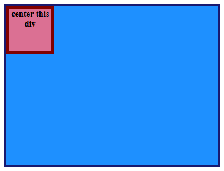
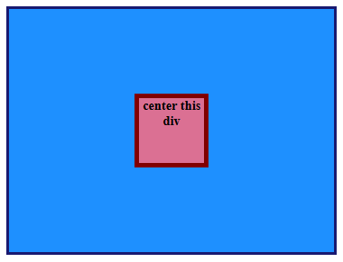
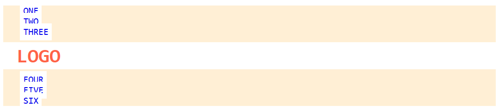
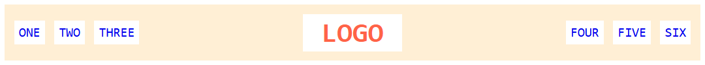
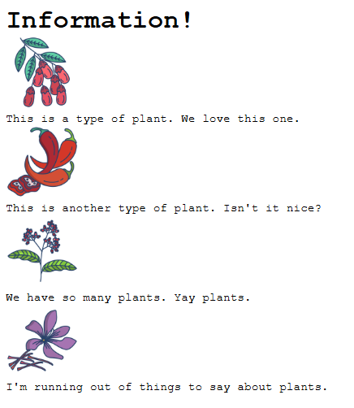
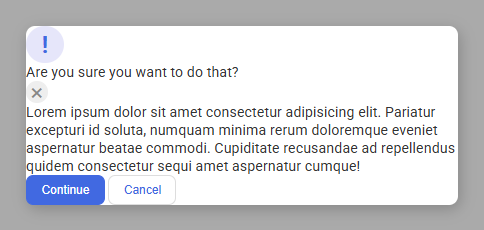
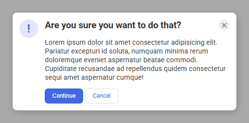
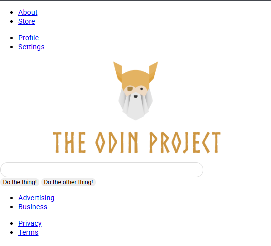
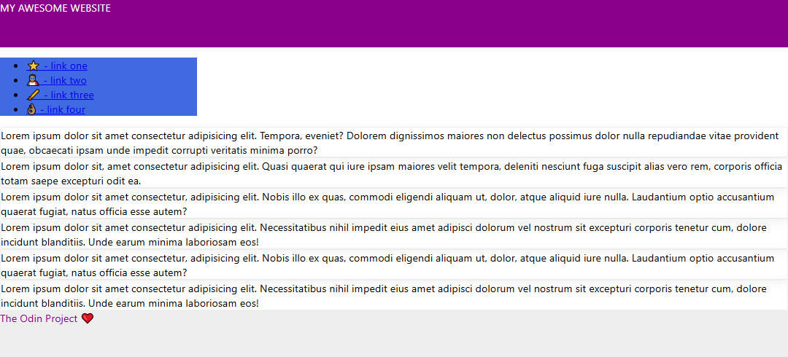
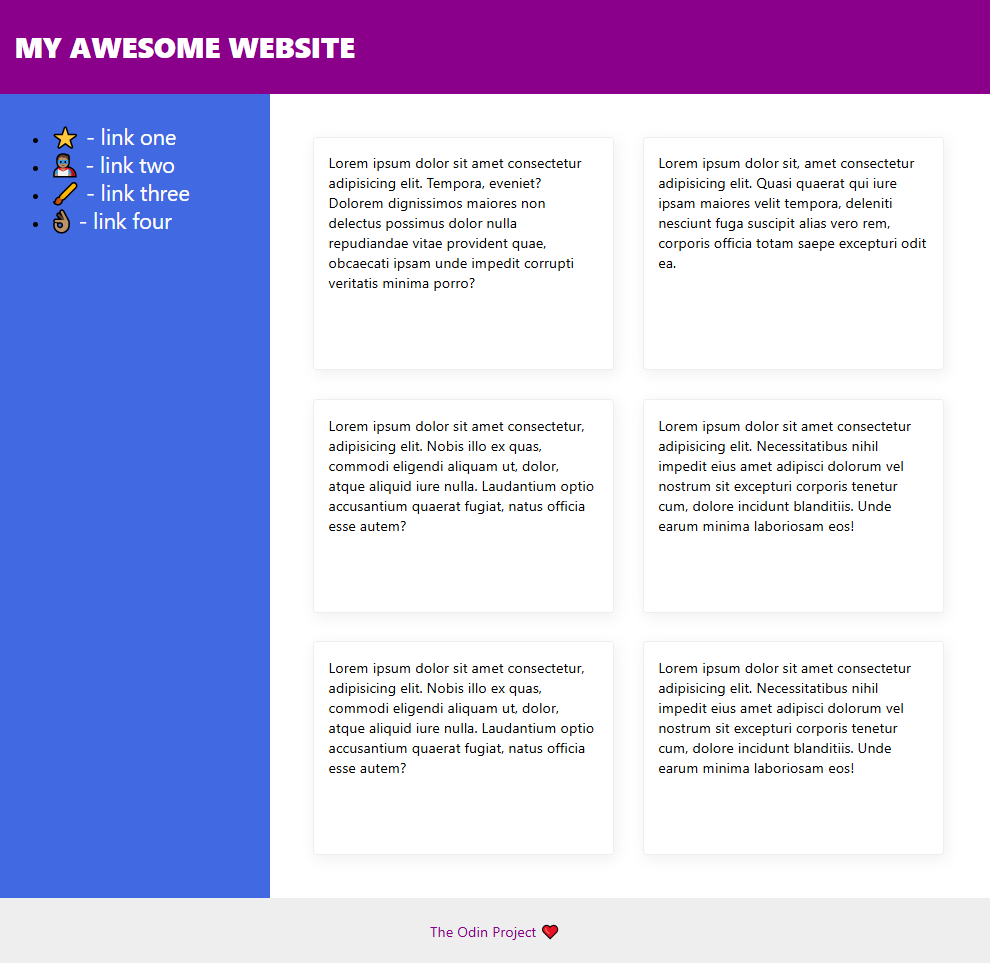

# Flex Alignment

Exercises implementing `display: flex;` to solve alignment issues.

- Completed as part of the **CSS Foundations** section of the **Foundation Course** at [TheOdinProject](https://www.theodinproject.com).
- Taken from  the specified **css-exercises** repo; specifically the folder pertaining to [flex](https://github.com/TheOdinProject/css-exercises/tree/main/foundations/flex)

---

## Assignment Instructions

 - ### [01 - Flex Center &rArr;](./flex/01-flex-center/)
 - ### [02 - Flex Header &rArr;](./flex/02-flex-header/)
 - ### [03 - Flex Header 2 &rArr;](./flex/03-flex-header-2/)
 - ### [04 - Flex Information &rArr;](./flex/04-flex-information/)
 - ### [05 - Flex Modal &rArr;](./flex/05-flex-modal/)
 - ### [06 - Flex Layout 1 &rArr;](./flex/06-flex-layout-1/)
 - ### [07 - Flex Layout 2 &rArr;](./flex/07-flex-layout-2/)

## Results

<table>

<tr>
<td width="47%">

### 01 - Flex Center

</td>
<td width="6%"></td>
<td width="47%"></td>
</tr>

<tr>
<td>

#### BEFORE

</td>
<td></td>
<td>

#### AFTER

</td>
</tr>

<tr>
<td>

</td>
<td align="center">
<h1>&rArr;</h1>
</td>
<td>

</td>
</tr>

<tr>
<td>

### 02 - Flex Header

</td>
<td></td>
<td></td>
</tr>

<tr>
<td>

#### BEFORE

</td>
<td></td>
<td>

#### AFTER

</td>
</tr>

<tr>
<td>

</td>
<td align="center">
<h1>&rArr;</h1>
</td>
<td>

</td>
</tr>

<tr>
<td>

### 03 - Flex Header 2

</td>
<td></td>
<td></td>
</tr>

<tr>
<td>

#### BEFORE

</td>
<td></td>
<td>

#### AFTER

</td>
</tr>

<tr>
<td>

</td>
<td align="center">
<h1>&rArr;</h1>
</td>
<td>

</td>
</tr>

<tr>
<td>

### 04 - Flex Information

</td>
<td></td>
<td></td>
</tr>

<tr>
<td>

#### BEFORE

</td>
<td></td>
<td>

#### AFTER

</td>
</tr>

<tr>
<td>

</td>
<td align="center">
<h1>&rArr;</h1>
</td>
<td>

</td>
</tr>

<tr>
<td>

### 05 - Flex Modal

</td>
<td></td>
<td></td>
</tr>

<tr>
<td>

#### BEFORE

</td>
<td></td>
<td>

#### AFTER

</td>
</tr>

<tr>
<td>

</td>
<td align="center">
<h1>&rArr;</h1>
</td>
<td>

</td>
</tr>

<tr>
<td>

### 06 - Flex Layout 1

</td>
<td></td>
<td></td>
</tr>

<tr>
<td>

#### BEFORE

</td>
<td></td>
<td>

#### AFTER

</td>
</tr>

<tr>
<td>

</td>
<td align="center">
<h1>&rArr;</h1>
</td>
<td>

</td>
</tr>

<tr>
<td>

### 06 - Flex Layout 2

</td>
<td></td>
<td></td>
</tr>

<tr>
<td>

#### BEFORE

</td>
<td></td>
<td>

#### AFTER

</td>
</tr>

<tr>
<td>

</td>
<td align="center">
<h1>&rArr;</h1>
</td>
<td>

</td>
</tr>

</table>
